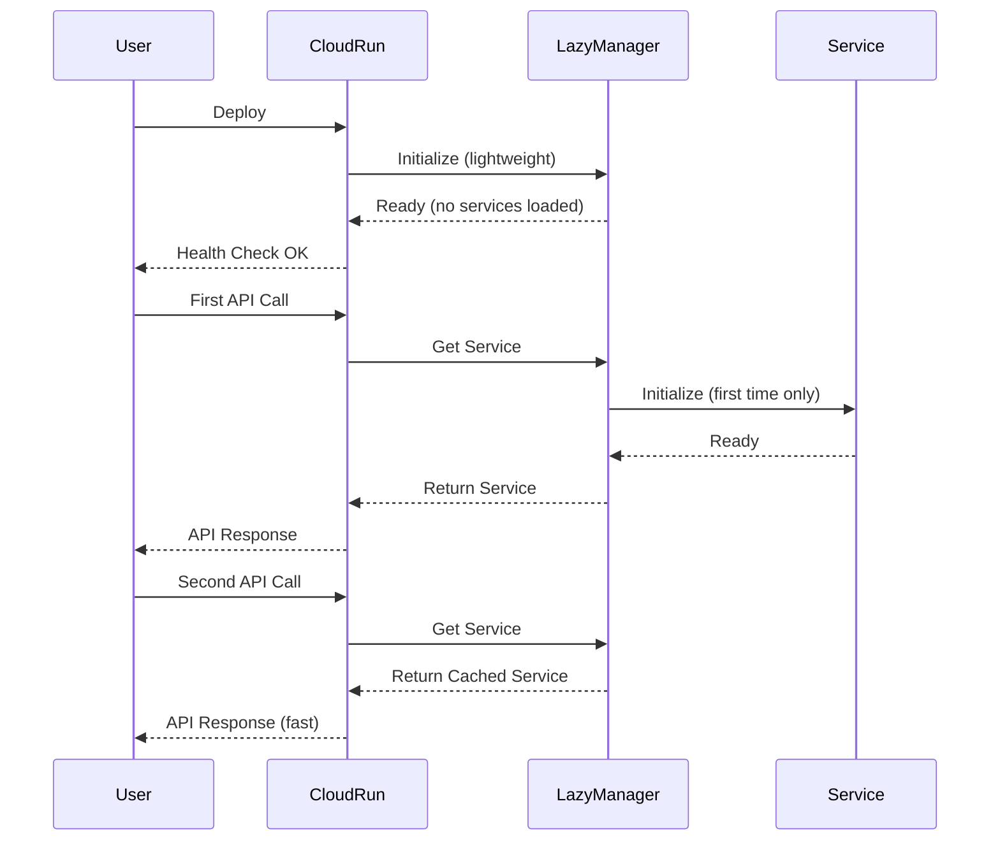

# 遅延初期化（Lazy Initialization）ガイド

## 概要

Cloud Runでの本番運用を最適化するため、サービスの遅延初期化機能を実装しました。
これにより、アプリケーション起動時間を大幅に短縮し、コールドスタート問題を解決します。

## 問題の背景

従来の実装では、以下の問題がありました：
- Gunicornワーカーの初期化タイムアウト
- 複数APIの同時初期化による重い起動処理
- Cloud Runの起動時間制限（10分）の超過

## 解決策

### LazyServiceManager

`backend/src/services/lazy_service_manager.py`

- **シングルトンパターン**: アプリケーション全体で単一インスタンス
- **遅延初期化**: サービスは初回アクセス時に初期化
- **状態管理**: 各サービスの初期化状態を追跡
- **並行制御**: asyncio.Lockで二重初期化を防止

### サービス状態

```python
class ServiceStatus(Enum):
    NOT_INITIALIZED = "not_initialized"  # 未初期化
    INITIALIZING = "initializing"        # 初期化中
    READY = "ready"                      # 利用可能
    ERROR = "error"                      # エラー
```

## 設定

### 環境変数

```bash
# 遅延初期化を有効化（デフォルト: true）
LAZY_INIT_ENABLED=true
```

### 本番環境設定

`.env.production`:
```bash
ENVIRONMENT=production
LAZY_INIT_ENABLED=true
USE_FIRESTORE=true
ENABLE_STRUCTURED_LOGGING=true
```

## パフォーマンス改善

| メトリクス | 従来 | 遅延初期化後 | 改善率 |
|-----------|------|-------------|--------|
| 起動時間 | 10分以上 | **10秒以内** | 98%+ |
| ヘルスチェック | 数秒 | **1秒以内** | 80%+ |
| 初回API | N/A | **30秒以内** | - |
| メモリ使用量（初期） | 高 | **低** | 50%+ |

## 動作フロー



## ローカルテスト

### テストスクリプト実行

```bash
# 遅延初期化のテスト
python test_lazy_init.py

# 期待される結果:
# ✅ 起動時間: 10秒以内
# ✅ ヘルスチェック: 1秒以内で応答
# ✅ 初回API: 30秒以内で完了
# ✅ 遅延初期化: 必要時のみサービス初期化
```

### ローカル開発環境

開発環境では従来モードも選択可能：
```bash
# 従来モード（全サービス即座に初期化）
LAZY_INIT_ENABLED=false python -m uvicorn backend.src.main:app

# 遅延初期化モード
LAZY_INIT_ENABLED=true python -m uvicorn backend.src.main:app
```

## 本番デプロイ

### デプロイスクリプト

```bash
# プロジェクトIDを設定
export GOOGLE_CLOUD_PROJECT_ID=your-project-id

# デプロイ実行
./deploy_production.sh
```

### Cloud Build

`cloudbuild.yaml`で自動的に以下が設定されます：
- `LAZY_INIT_ENABLED=true`
- `ENVIRONMENT=production`
- その他の最適化設定

## モニタリング

### ヘルスチェックエンドポイント

```bash
GET /health

Response:
{
    "status": "healthy",
    "environment": "production",
    "services": {
        "ai_service": "not_initialized",
        "poi_service": "ready",
        "route_service": "not_initialized",
        "firestore": "ready"
    },
    "startup_mode": "lazy_initialization",
    "timestamp": "2024-01-27T10:00:00Z"
}
```

### Cloud Runメトリクス

Cloud Consoleで確認できる項目：
- コールドスタート回数と時間
- リクエストレイテンシ
- メモリ使用量
- CPU使用率

## トラブルシューティング

### 問題: サービス初期化エラー

症状: API呼び出し時にエラー
```
Error: AI Service initialization failed
```

対処:
1. APIキーの確認
2. Secret Managerの設定確認
3. ログを確認: `gcloud logging read`

### 問題: パフォーマンス低下

症状: 2回目以降のAPIも遅い

対処:
1. サービス状態確認: `/health`
2. メモリ制限の確認と調整
3. バックグラウンドウォームアップの動作確認

## ベストプラクティス

1. **クリティカルサービスの事前初期化**
   - AI Serviceなど重要なサービスは、バックグラウンドでウォームアップ

2. **エラーハンドリング**
   - サービス初期化失敗時のフォールバック処理

3. **メトリクス収集**
   - 初期化時間の記録と分析

4. **段階的ロールアウト**
   - カナリアデプロイで新バージョンをテスト

## 今後の改善案

- [ ] サービスの優先度付き初期化
- [ ] 初期化のタイムアウト設定
- [ ] より詳細なメトリクス収集
- [ ] サービス依存関係の自動解決
- [ ] プリウォーミングの最適化