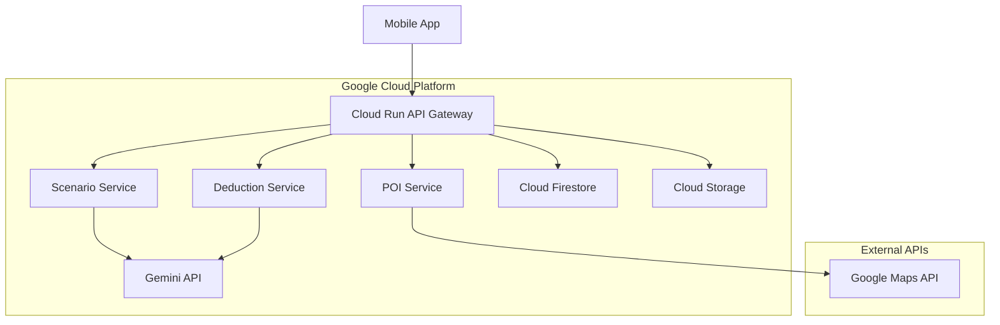

# システム設計書 - AIミステリー散歩

## アーキテクチャ概要



## コンポーネント設計

### 1. Mobile App (Flutter)
**責務**: ユーザーインターフェース、GPS機能、ゲーム状態管理

**主要機能**:
- GPS位置情報の取得と監視
- ゲーム画面の表示（探偵事務所、証拠発見、推理パート）
- バックエンドAPIとの通信
- ローカル状態管理（進行中のゲーム）

**技術スタック**:
- Flutter 3.x
- GPS: geolocator package
- 状態管理: Provider/Riverpod
- HTTP通信: dio package

### 2. Cloud Run API Gateway
**責務**: APIエンドポイントの提供、認証、リクエストルーティング

**エンドポイント**:
```
POST /api/v1/game/start          # ゲーム開始
GET  /api/v1/game/{gameId}       # ゲーム状態取得
POST /api/v1/evidence/discover   # 証拠発見
POST /api/v1/deduction/submit    # 推理回答
```

**技術スタック**:
- Python 3.11 + FastAPI
- Cloud Run (serverless)
- Cloud IAM (認証)

### 3. Scenario Service
**責務**: AIを使った事件シナリオの生成

**機能**:
- 被害者・容疑者・関係性の生成
- 導入文（200-500字）の生成
- 難易度に応じた複雑さ調整
- ミスリード要素の配置

**Gemini API連携**:
- モデル: gemini-1.5-pro
- プロンプト設計: 構造化されたシナリオ生成
- 出力形式: JSON構造

### 4. POI Service
**責務**: GPS座標周辺のPOI検索と証拠配置

**機能**:
- Google Maps API連携
- 現在地周辺のPOI取得
- 証拠とPOIのマッチング
- 到達判定（半径50m以内）

### 5. Deduction Service
**責務**: 推理回答の判定とキャラクター反応生成

**機能**:
- 犯人名の正誤判定
- キャラクター特性に基づいたコメント生成
- 正解/不正解パターンの分岐

## データモデル

### Game Session
```json
{
  "gameId": "uuid",
  "playerId": "uuid",
  "status": "active|completed",
  "difficulty": "easy|normal|hard",
  "scenario": {
    "title": "string",
    "description": "string",
    "victim": "Character",
    "suspects": ["Character"],
    "culprit": "string",
    "evidence": ["Evidence"]
  },
  "playerLocation": {
    "lat": "float",
    "lng": "float"
  },
  "discoveredEvidence": ["evidenceId"],
  "createdAt": "timestamp",
  "updatedAt": "timestamp"
}
```

### Character
```json
{
  "name": "string",
  "age": "int",
  "occupation": "string",
  "personality": "string",
  "temperament": "calm|volatile|sarcastic|defensive|nervous",
  "relationship": "string",
  "alibi": "string",
  "motive": "string"
}
```

### Evidence
```json
{
  "evidenceId": "uuid",
  "name": "string",
  "description": "string",
  "location": {
    "lat": "float",
    "lng": "float",
    "poiName": "string",
    "poiType": "string"
  },
  "importance": "critical|important|misleading",
  "discoveredAt": "timestamp?"
}
```

### POI (Point of Interest)
```json
{
  "poiId": "string",
  "name": "string",
  "type": "restaurant|park|landmark|cafe|station",
  "location": {
    "lat": "float",
    "lng": "float"
  },
  "address": "string"
}
```

## API仕様

### POST /api/v1/game/start
**リクエスト**:
```json
{
  "playerId": "uuid",
  "location": {
    "lat": 35.6762,
    "lng": 139.6503
  },
  "difficulty": "normal"
}
```

**レスポンス**:
```json
{
  "gameId": "uuid",
  "scenario": {
    "title": "カフェに響く悲鳴",
    "description": "午後3時、渋谷の人気カフェ『ブルーマウンテン』で...",
    "suspects": ["Character"]
  },
  "evidence": [
    {
      "evidenceId": "uuid",
      "name": "血のついたコーヒーカップ",
      "location": {
        "lat": 35.6762,
        "lng": 139.6503,
        "poiName": "渋谷スカイ"
      }
    }
  ]
}
```

### POST /api/v1/deduction/submit
**リクエスト**:
```json
{
  "gameId": "uuid",
  "suspectName": "田中太郎"
}
```

**レスポンス**:
```json
{
  "correct": true,
  "reactions": [
    {
      "character": "田中太郎",
      "reaction": "くっ...見破られたか。そうだ、俺がやったんだ！",
      "type": "confession"
    },
    {
      "character": "警察官",
      "reaction": "見事な推理でした。これで事件は解決ですね。",
      "type": "praise"
    }
  ]
}
```

## セキュリティ考慮事項

- Cloud IAM による認証
- API Key の適切な管理
- 位置情報の暗号化保存
- レート制限の実装

## パフォーマンス最適化

- Cloud CDN によるキャッシュ
- Gemini API のレスポンス時間最適化
- モバイルアプリの軽量化
- POI検索結果のキャッシュ